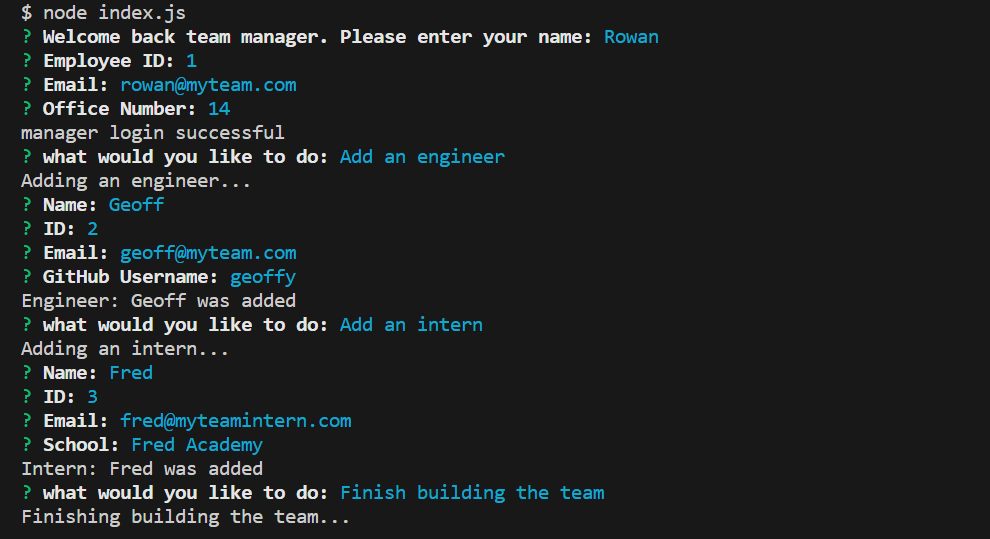

# Team Profile Generator (using Object Oriented Programming)

## Project Status
on pause, for now.

## Description
Team Profile Generator is a tool that takes user input from a Team Manager and translates the information into employee cards, displayed on a generated html page. The aim of the project was to challenge and test my skills in node, testing and inquirer whilst creating a user-friendly tool that is both functional and aesthetically considered. Users can quickly and easily display their whole team on a webpage, from answering a few questions, without need for an understanding of complicated html. The project makes use of Node.js, Inquirer, Jest, HTML, CSS, JavaScript, Bootstrap and JSON.  

## Table of Contents
[Project Status](https://github.com/RowanKinross/OOP_Team_Profile_Generator_RK?tab=readme-ov-file#project-status)  
[Description](https://github.com/RowanKinross/OOP_Team_Profile_Generator_RK?tab=readme-ov-file#description)  
[Installation](https://github.com/RowanKinross/OOP_Team_Profile_Generator_RK?tab=readme-ov-file#installation)  
[Usage](https://github.com/RowanKinross/OOP_Team_Profile_Generator_RK?tab=readme-ov-file#usage)  
[Demo](https://github.com/RowanKinross/OOP_Team_Profile_Generator_RK?tab=readme-ov-file#demo)  
[License](https://github.com/RowanKinross/OOP_Team_Profile_Generator_RK?tab=readme-ov-file#license)  
[Contributors](https://github.com/RowanKinross/OOP_Team_Profile_Generator_RK?tab=readme-ov-file#contributors)  
[Credits](https://github.com/RowanKinross/OOP_Team_Profile_Generator_RK?tab=readme-ov-file#credits)  
[Tests](https://github.com/RowanKinross/OOP_Team_Profile_Generator_RK?tab=readme-ov-file#tests)  
[Questions](https://github.com/RowanKinross/OOP_Team_Profile_Generator_RK?tab=readme-ov-file#questions)
  
## Installation
n/a

## Usage
Upon opening the project, the user is shown a repository of code and folders from which they must open the integrated terminal and type "node index.js" to begin the application. The user will then be prompted with a series of questions to gather information about them and their team. If an input is left blank, the user will be directed that the input cannot be left blank and prompted to try again. Once all of the fields have been filled out and the user does not wish to add any more team members, they can select the "Finish building the team" option for the html file to be generated. The personalised html file can then be found in the "output" folder where the user can create a copy for their own repo.

## Demo

## License
MIT License

## Contributors
n/a

## Credits
edX for provided me with the skills take on this challenge

## Tests
Tests can be found in the test folder and by using the command "npm test", also in the integrated terminal. All provided tests (17) currently pass.

## Questions
If you have any further questions you can find me here:
GitHub - https://github.com/RowanKinross